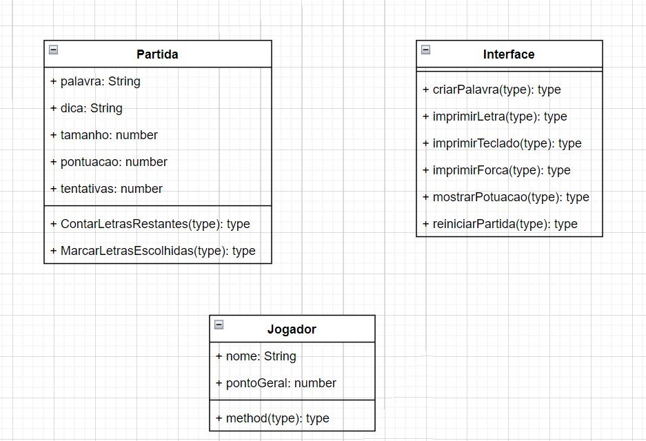
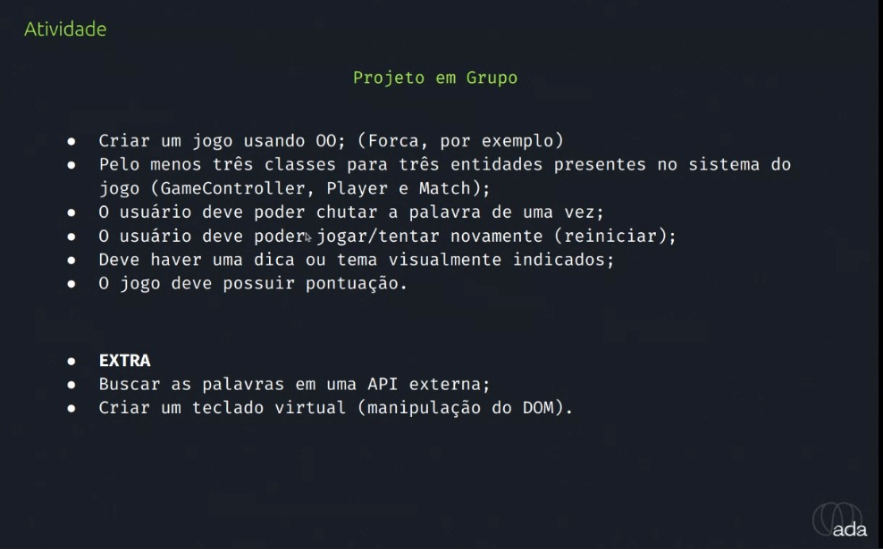

# Jogo da Forca
Projeto desenvolvido em grupo no programa Santander Coders Frontend
 Módulo: Programação Orientada a Objetos
Projeto publicado: https://diegonf.github.io/Project_SantanderCoders_JogoForca/

## Participantes
* Ana
* Diego
* Gabriella
* Octavio
* Samuel

## UML

## Requisitos

